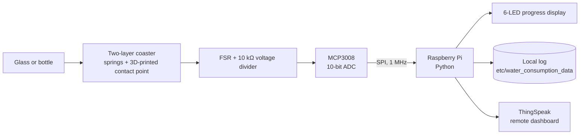
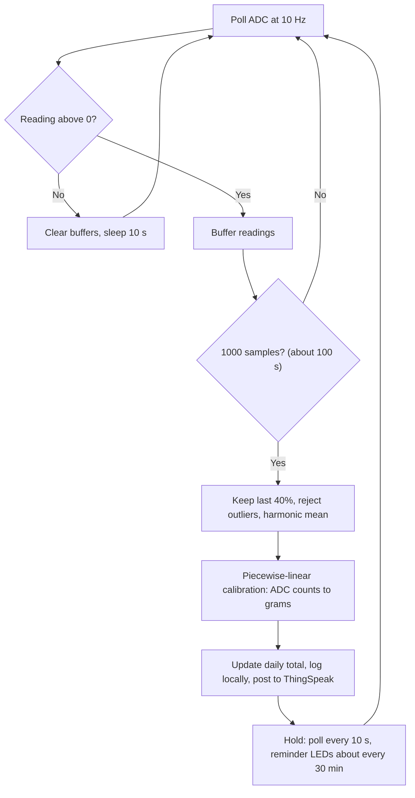

# Smart Coaster: low-cost hydration tracking with a force-sensing resistor

A smart coaster that tracks how much a person drinks simply by resting a glass or bottle on it. A force-sensing resistor (FSR) under the coaster is read through an ADC by a Raspberry Pi, which converts the signal to a mass, works out how much was drunk between readings, shows progress on an LED array and uploads the data so a carer can follow along remotely.

Built as a BEng final-year project (Electrical & Electronic Engineering, University of Birmingham, 2024) for roughly **£80**.

## Why

Hydration is hard to monitor for older people and for some neurodivergent people, who may not notice thirst. Existing options are phone apps that rely on manual logging, or smart bottles that are costly and tie the user to a single container. A coaster works with any glass and is a familiar object, so it needs no change in habit.

## System overview



The project has three parts: a mechanical stack that delivers force to the sensor consistently, an electronic front end that turns it into a digital value, and software that turns noisy readings into a reliable mass and a daily consumption total.

## Mechanical design

An FSR is cheap and robust but sensitive to *how* force reaches it, so most of the build effort went into the load path.

- Placing a weight directly on the sensor, or using a single coaster, gave poor, inconsistent results.
- The final stack is **two cork-backed coasters bolted together** (four holes, 15 mm from each corner), with **3D-printed parts** forming a single contact point on the sensor. Concentrating force at one point proved more repeatable than spreading it across the whole sensor.
- Residual force stayed on the sensor after a load was removed, giving non-zero unloaded readings. Fixed with **ballpoint-pen springs** around **Teflon bolts** (low friction), so the top plate returns to rest.
- **Spacers** on the top surface constrain horizontal movement and allow vertical travel only, so the contact point lands on the same spot every time.
- The nuts set the preload so the contact point sits just above the sensor at rest.

## Electronics

| Choice | Reason |
|---|---|
| Raspberry Pi (not an Arduino Uno) | Built-in Wi-Fi/Bluetooth, timekeeping and storage, all needed for time-stamping, logging and upload. An Arduino would need extra modules for each. |
| MCP3008 ADC | The Pi has no analogue inputs. The MCP3008 adds 8 channels of 10-bit conversion (0 to 1023) over SPI with almost no extra components. Only channel 0 is used. |
| 10 kΩ divider resistor | Chosen to give good separation between loads, particularly at higher forces where larger resistor values compress the output. |
| Single ribbon cable, USB power | Keeps wiring simple and the prototype portable. |

Wiring between the Pi and the MCP3008:

| Raspberry Pi | MCP3008 |
|---|---|
| Pin 2 (5V) | Pin 16 (VDD) and Pin 15 (VREF) |
| Pin 6 (GND) | Pin 14 (AGND) and Pin 9 (DGND) |
| Pin 23 (SCLK) | Pin 13 (CLK) |
| Pin 21 (MISO) | Pin 12 (DOUT) |
| Pin 19 (MOSI) | Pin 11 (DIN) |
| Pin 24 (CE0) | Pin 10 (CS/SHDN) |

The FSR and 10 kΩ resistor form a voltage divider feeding channel 0.

**LED array:** six LEDs (two red, two yellow, two green on BCM pins 23/24, 12/16 and 20/21). They show power-on, a measurement being registered, and progress towards the daily goal (red above 1/6 of goal, yellow above 3/6, green above 5/6, with a celebratory animation when the goal is reached). They also give a reminder animation roughly every 30 minutes while a drink is sitting on the coaster.

## Software

Python, chosen for speed of prototyping. Readings are in raw ADC counts (0 to 1023), referred to as "voltage" in the code and report.



### Turning a noisy FSR signal into a mass

Evaluation of raw data showed four problems, each with a specific mitigation:

| Problem | Mitigation |
|---|---|
| Steep, roughly logarithmic rise in the signal when a load is first applied | Discard the first 60% of each 1000-sample window and use only the last 400 samples |
| Oscillation around the mean, from the springs and the ADC's whole-number output | Average the retained samples (harmonic mean, after rejecting samples more than 3% from it) |
| FSR drift: the reading creeps upward under constant load | Measure only in a short window (about 100 s) after a load is detected, so a drink left overnight still gives a valid reading |
| Placement variation and non-linear response | Calibrate against known masses and interpolate, with a standard centre mark for placement |

**Calibration:** a 1-litre bottle was weighed on a digital scale in 50 g steps from 0 to 1000 g. The processed mean reading for each mass is stored as a lookup table and interpolated with `scipy.interpolate.interp1d` (piecewise linear, with extrapolation). The response is strongly non-linear: readings for loads above about 500 g are bunched between roughly 890 and 970 counts, while the steepest change is between roughly 350 and 500 g. The table ends at 150 g, so smaller loads are not detected.

### Consumption logic

- A reading above zero means something is on the coaster.
- After each measurement the difference from the previous mass is added to the day's total, in grams (treated as millilitres).
- A rise of more than 10 g is treated as a refill and not counted; smaller rises are treated as sensor noise.
- The daily goal is currently fixed at 2000 ml. At midnight the day's entries are exported to `etc/Daily/<date>` and the total resets.

### Persistence and reporting

- Every measurement is appended to `etc/water_consumption_data` as `date, time, mass (g), ADC reading, daily consumption`.
- On start-up the last line of that file is read back, so a power cut does not reset the day's progress.
- Each measurement is also posted to a [ThingSpeak](https://thingspeak.com) channel (ADC reading, mass, daily consumption) for remote viewing by a user or carer.
- Raw ADC samples are logged to `etc/test1` for offline analysis.

## Results

A test run on 2024-04-11 compared the coaster's reading with a more accurate scale for a bottle being drunk down (figures from the project report):

| Coaster (g) | Scale (g) | Error |
|---|---|---|
| 715 | 712 | +3 g (0.4%) |
| 615 | 620 | −5 g (0.8%) |
| 552 | 559 | −7 g (1.3%) |
| 484 | 490 | −6 g (1.2%) |
| 410 | 420 | −10 g (2.4%) |

Errors were within about 10 g on this run, small relative to a daily intake of litres. FSR repeatability is quoted at about 2%, which is roughly 20 ml at 1 kg. A daily total within ±100 ml (about 5%) was judged acceptable for this use case, where presence and trend matter more than precision.

## Repository layout

| Path | Purpose |
|---|---|
| `__main__.py` | Main application: acquisition loop, filtering, calibration, consumption tracking, logging, ThingSpeak upload |
| `MCP3008.py` | Minimal SPI driver for the MCP3008 ADC |
| `LEDControl.py` | GPIO control and animations for the LED array |
| `tester.py` | Prints the raw channel 0 reading once a second, for bring-up and wiring checks |
| `convert.py` | Offline helper that converts a raw ADC log to grams using the calibration table |
| `etc/` | Runtime data: consumption log, per-day exports (`Daily/`), raw sample log (`test1`) and its converted version (`test1_weight`), plus an earlier version of the main script (`main.py`) |
| `py-spidev-master/` | Vendored copy of [py-spidev](https://github.com/doceme/py-spidev) (MIT licence), the SPI library used by `MCP3008.py` |

## Running it

Requirements: a Raspberry Pi with SPI enabled (`raspi-config`), Python 3.11+, and the `spidev`, `RPi.GPIO` and `scipy` packages. A network connection is needed for ThingSpeak uploads; without one the post fails and measurement and local logging continue.

```bash
# from the repository root (paths such as etc/ are relative)
python3 tester.py    # check the wiring: values should rise as you press the coaster
python3 .            # run the tracker
```

Set the ThingSpeak write key in the `key` variable in `__main__.py` and keep it out of version control. The tuning constants (sample interval, window size, retained fraction, outlier threshold, refill tolerance, daily goal) are plain values in `__main__.py`.

## Limitations

- **Calibration is fixed and goes stale.** The mapping is tied to this physical build, and bolt tightness changes with use, so it needs periodic recalibration.
- **Small loads are not detected.** The calibration ends at 150 g, so an almost empty glass reads as empty.
- **Off-centre placement** changes the reading; the mechanics reduce this but do not remove it.
- **FSR drift and non-linearity** are managed in software, not eliminated.
- **Fixed goal and a simple refill heuristic.** The goal is hard-coded, and a refill is detected by a rise of more than 10 g.
- **Supply voltage.** The wiring above powers the MCP3008 from 5 V, so its DOUT line swings to 5 V into a Pi GPIO that is only rated for 3.3 V. If rebuilding this, power the ADC from 3.3 V or add a level shifter.

## Possible next steps

- Replace the Pi with a microcontroller plus a dedicated Wi-Fi chip, then a custom integrated circuit and battery power, for a small commercial form factor.
- Add a phone app (originally planned, replaced with ThingSpeak because of time) and stronger alerts such as text messages.
- Manufacture the force-transfer assembly rather than a DIY stack, which would improve repeatability.
- Per-user daily goals, and automatic recalibration.

## Acknowledgements

The Duke University 2022 Hackathon "Smart Coaster" project used a similar linear-regression approach and was a useful comparison. SPI access uses [py-spidev](https://github.com/doceme/py-spidev).
